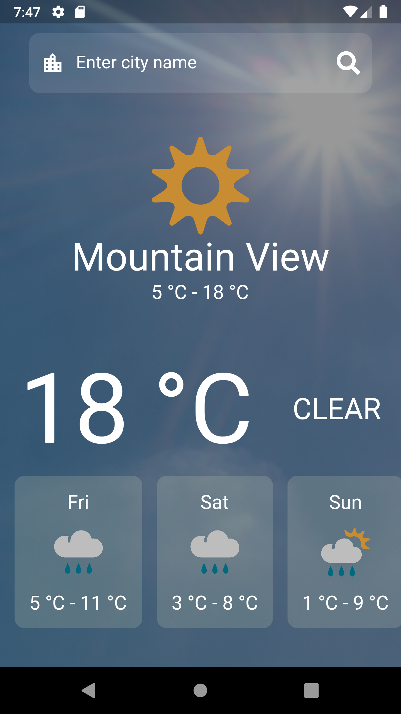
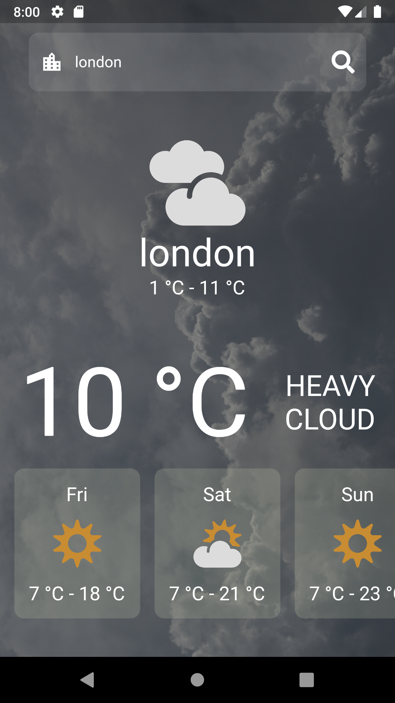
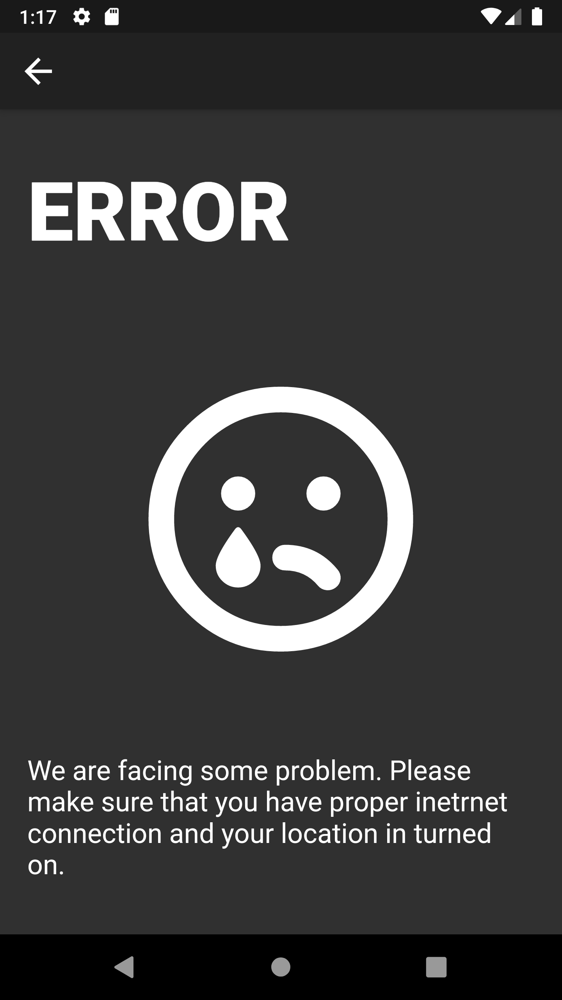

# Weather 

This is a fully functioning weather app which requires internet connection and geolocation services from user's phone.

It grabs the weather information of your current location. User can also search weather condition of another location as well just by searching with the city names.

## Screenshots

  
   
  

